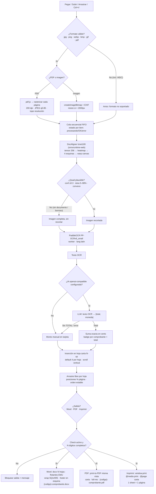

# Especificación — Cortar y Ordenar Facturas

App frontend-only, Chrome-only. TypeScript + Vite+ (toolchain VoidZero: Vite 8, Vitest, Oxlint, Oxfmt; comandos `vp`, package manager pnpm 11). Sin backend.

## Resumen

Pegar/subir/arrastrar imágenes y PDFs → recorte DocAligner (heatmap/lcnet100 vía onnxruntime-web + warp en canvas) → OCR con PaddleOCR (PP-OCRv6_small) → extracción de TOTAL con LLM openai-compatible (o monto manual) → grilla carta N-up (default 4, arrastre libre tipo Word) → salidas Word (.docx) / PDF (print-to-PDF) / Imprimir, con footer (código de pedido).

## Estructura / esqueleto

```
facturas/
├─ index.html
├─ package.json
├─ pnpm-workspace.yaml   # catalog: vite/vite-plus + overrides (no tocar los alias)
├─ tsconfig.json
├─ vite.config.ts          # vite-plus: bloques staged/fmt/lint + COOP/COEP, server.open, build → dist/
├─ .gitignore
├─ spec.md
└─ src/
   ├─ main.ts              # bootstrap app
   ├─ types.ts             # Comprobante, Estado, Config, OcrResult...
   ├─ state.ts             # estado global + persistencia (check, N, moneda, IA)
   ├─ ui/
   │  ├─ layout.ts         # esqueleto pantalla (header, monto, main, sidebar)
   │  ├─ sidebar.ts        # dropzone (arrastrar/clic/pegar), ordenar N, +OCR, limpiar, descargar
   │  ├─ sheets.ts         # render hojas carta, grilla N-up, drag & drop libre, scroll
   │  ├─ monto.ts          # badge por comprobante + suma total (cents exactos)
   │  ├─ ocrModal.ts       # ventana flotante texto OCR (solo lectura + copiar)
   │  └─ settingsModal.ts  # endpoint, model, apiKey, moneda
   ├─ pipeline/
   │  ├─ docaligner.ts     # DocAligner heatmap/lcnet100 (onnxruntime-web webgpu→wasm) + warp canvas, fallback full
   │  ├─ ocr.ts            # PaddleOCR.create({ocrVersion:'PP-OCRv6', lang:'latin', worker:true})
   │  ├─ pdf.ts            # pdf.js → cada página a ImageBitmap (200dpi, JPEG .85, tope res)
   │  ├─ extract.ts        # LLM openai-compatible: texto OCR → {total, currency}
   │  └─ queue.ts          # cola secuencial FIFO, estado por item (procesando/OK/error)
   └─ export/
      └─ salidas.ts        # Word (.docx vía docx: EMU + wrap SQUARE + footer) + PDF (print-to-PDF) + Imprimir (window.print); gate y nombre comunes
```

## Decisiones (AC)

- **Código pedido:** check on/off + input N (solo dígitos), ambos persisten en localStorage; esquina elegida (default inferior derecha) en todas las hojas de cada salida; check activo con < N dígitos → bloquear la salida con mensaje.
- **Monto:** 1 TOTAL por comprobante; suma exacta en cents (sin float); badge por comprobante + total; moneda configurable (default USD, formato US `1,234.56`); LLM sin TOTAL → campo manual en tarjeta (sí suma).
- **Limpiar:** borra comprobantes, montos y textos OCR; conserva check, N, y configuración IA/moneda.
- **Recorte:** DocAligner heatmap/lcnet100 vendoreado (`public/models/`, Apache-2.0, ver NOTICE.txt); foto con borde negro 100px (receta del demo: extrapola esquinas cortadas), inferencia onnxruntime-web (WebGPU→WASM, `public/ort/`), warp por homografía en canvas con fondo blanco; sin 4 esquinas plausibles (conf ≥0.3, área 5–98%, convexo) → imagen completa, la cola sigue. Sin config de modelo en UI.
- **Errores:** continuar + estado por item; el monto suma solo los OK; el resto se procesa.
- **Formato de entrada:**imágenes + PDF multipágina (cada página no-blanca = comprobante; blancas/vacías se omiten); un PDF entra solo si pesa ≤ 5 MB y tiene ≤ 10 páginas (cada archivo se evalúa solo; rechazo → aviso en la entrada, sin entrar a la cola); HEIC → aviso "formato no soportado", no falla la cola.
- **EXIF:** createImageBitmap con orientación respetada; redimensionar automática si > 2000px lado mayor.
- **Grilla:** N por hoja default 4; arrastre libre dentro de la hoja (posiciones % página, z-order), NO cambia el orden de inserción; X elimina comprobante completo; scroll vertical, hojas ajustadas al ancho.
- **OCR modal:** solo lectura, select por comprobante, botón copiar; texto usado solo por el LLM.
- **IA:** modal ajustes (baseURL, apiKey en localStorage, model por defecto gpt-4o-mini); sin config → monto manual; nunca expone la key en el repo.
- **Salidas (Word / PDF / Imprimir):** una sola fuente (`state.hojas` + layout + `codigoPosicion`: la vista previa carta es lo que sale); gate común (`codigoValido()` + ≥1 comprobante, si no → bloquear + mensaje); nombre `{codigo}-comprobante.{docx|pdf}` (`sincodigo-` sin código).
- **Word:** `docx` (npm, dep aprobada) OOXML estándar; imágenes flotantes con posición absoluta en EMU relativa a página + wrap SQUARE; footer en `codigoPosicion` en todas las hojas; validar en Word y LibreOffice. (STUB actual descarga `.txt`: la implementación real va en `salidas.ts`.)
- **PDF:** sin deps: print-to-PDF del diálogo de impresión sobre la misma vista; carta, imágenes full-res (no thumbs), footer en `codigoPosicion`.
- **Imprimir:** sin deps: `window.print()` + `@media print` (oculta sidebar/paneles/botones) + `@page carta`; una `.sheet` = una página.
- **Dev/Prod:** `pnpm dev` (vp dev --open, COOP/COEP en vite.config para WASM threads); `pnpm build` (vp build) → `dist/` para producción; `vp check` (lint+formato+tipos), tests con binario `vitest` local (ver AGENTS.md: `vp test` roto en vp 0.3.0 con pnpm/jsdom); salidas: `docx` (npm) aprobada como única dep nueva (Word real), PDF/Imprimir sin deps (plataforma).

## Diagrama de flujo (mermaid)


