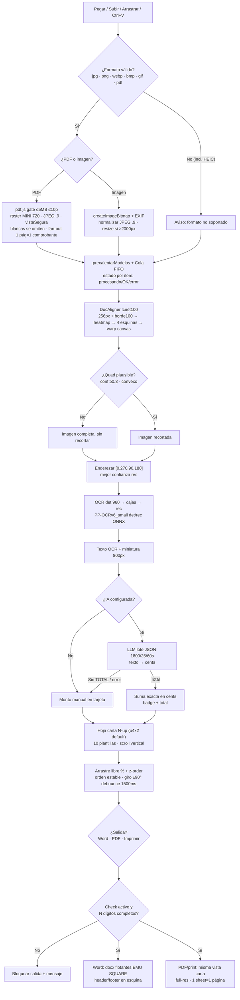

# Especificación — Cortar y Ordenar Facturas

App frontend-only, Chrome desktop-only. TypeScript + Vite+ (toolchain VoidZero: Vite 8, Vitest, Oxlint, Oxfmt; comandos `vp`, package manager pnpm 11). Sin backend.

> `PRODUCT.md` describe producto (usuario, tono, principios). En lo técnico manda este `spec.md`.

## 1. Resumen

Pegar/subir/arrastrar imágenes y PDFs → normalizar (`imagen.ts`) → recorte DocAligner heatmap/lcnet100 vía onnxruntime-web + warp canvas → enderezar por confianza OCR → OCR propio det+rec ONNX (PP-OCRv6_small) → extracción de TOTAL con LLM openai-compatible en lote (o monto manual) → grilla carta N-up con 10 plantillas (default `u4x2`, arrastre libre tipo Word) → salidas Word real (.docx) / PDF (print-to-PDF) / Imprimir, con código de pedido en esquina.

## 2. Estructura real

```
facturas/
├─ index.html            # DOM = contrato (39 ids, getEl falla fuerte si falta)
├─ package.json          # scripts vp + deps pineadas (ver §6)
├─ pnpm-workspace.yaml   # catalog vite/vite-plus + overrides + allowBuilds (no tocar alias)
├─ vite.config.ts        # servir-ort-crudo + COOP/COEP + staged + lint prefer-vite-plus-imports
├─ vitest.config.ts      # jsdom + src/**/*.test.ts + setup.ts
├─ spec.md               # este archivo (fuente técnica)
├─ public/
│  ├─ models/lcnet100_h_e_bifpn_256_fp32.onnx + ocr/det.onnx + ocr/rec.onnx + NOTICE.txt
│  ├─ ort/ort-wasm-simd-threaded.asyncify.{mjs,wasm}  # wasmPaths = BASE_URL ort/
│  └─ fonts/*.woff2 + llms.txt + robots.txt
└─ src/
   ├─ main.ts            # bootstrap: cargar() → init* → renders
   ├─ types.ts           # Comprobante, Hoja, EstadoApp. Solo tipos
   ├─ state.ts           # LS libro-mayor-state + memoria hojas/cola/modoOcr
   ├─ utils.ts           # getEl (throw si falta #id), sanear toWellFormed, sleep AbortSignal
   ├─ ui/
   │  ├─ layout.ts       # 10 plantillas + layoutDe (fallback u4x2)
   │  ├─ sidebar.ts      # dropzone/pegar/clic, gate PDF, avisos, btnIA, limpiar
   │  ├─ sheets.ts       # render carta, drag % + z-order, zoom 0.25–4, lupa, atajos M/Esc/Ctrl
   │  ├─ monto.ts        # Cents enteros, parsearMonto US estricto, formatear en-US
   │  ├─ ocrMode.ts      # toggle chkOcr (no persiste) + renderHojas
   │  └─ settingsModal.ts# baseUrl/model/apiKey/moneda + restablecerAjustes
   ├─ pipeline/
   │  ├─ imagen.ts       # JPEG único, LADO_MAX 2000, JPEG 0.9, blancas 99.5%/250
   │  ├─ docaligner.ts   # 256px/borde100/conf 0.3, EP webgpu→wasm 30s + latch, threads 1
   │  ├─ ocr.ts          # det 960 + enderezar [0,270,90,180] + rec chunks 16
   │  ├─ ocrDb.ts        # cajasDesdeMapa (bin 0.2, caja 0.45, max 3000, unclip 1.4)
   │  ├─ ocrRec.ts       # REC_ALTO 48, normalizar/apilar/decodificarCtc
   │  ├─ ocrDict.ts      # DICT 18710 + blank
   │  ├─ rotar.ts        # giro ±90°, QUIETUD 1500ms, releer tolerante
   │  ├─ pdf.ts          # gate ≤5MB ≤10p, MINI 720, vistaSegura, fan-out
   │  ├─ extract.ts      # lote JSON {"1":"12.50"}, 1800/12000/25/60s, auto al drenar
   │  └─ queue.ts        # drenado pendiente + precalentar + timings
   └─ export/
      └─ salidas.ts      # docx EMU+SQUARE+header/footer + print zonaPrint
```

44 files en `src/` según grafo. `state.hojas/colaEnProceso/modoOcr` no persisten.

## 3. Pipeline

- **imagen `imagen.ts:6,9,12-15`:** `LADO_MAX_IMAGEN=2000`, `CALIDAD_JPEG=0.9`, `BLANCO_UMBRAL=250/MUESTRA=4/RATIO=0.995`. `normalizarImagen` → JPEG único; `recortarMargenesBlancos` (bbox luminancia, guarda 15% si ralo `AREA_MINIMA=0.15`); error tipado `blanca|ilegible`.
- **docaligner `docaligner.ts:25,28,31,34,453,509,512`:** `LADO_MODELO=256`, `PAD_BORDE=100` (extrapola esquinas cortadas), `UMBRAL_HEATMAP=0.3`, `RUTA_MODELO=BASE_URL models/lcnet100...`, `TIMEOUT_EP_MS=30s` + `conTimeout` + latch `epCaidos` + `reintentarEps`, singleton `obtenerSesion/crearSesion`, `wasmPaths=BASE_URL ort/`, `numThreads=1`, EPs `["webgpu","wasm"]`. Sin quad plausible → imagen completa, la cola sigue. Sin config en UI.
- **ocr `ocr.ts:21-22,28,206,210-216,436`:** `RUTA_DET/REC=BASE_URL models/ocr/*.onnx`, `LADO_DET_MAX=960`, `DET_MEDIA/STD` ImageNet, `MULTIPLO=32`, `UMBRAL_MAPA_VACIO=0.0005`, `UMBRAL_REC_OK=0.9`, `TOP_CAJAS_GIRO=2`, `GIROS=[0,270,90,180]`, `CHUNK_REC=16`. `enderezar()` prueba giros y queda con mejor confianza; det solo recorta líneas.
- **queue `queue.ts:15,72,92,207`:** `THUMB_MAX=800`, `precalentarModelos()` al agregar, fases `detectarYRecortar→enderezar→extraerTexto→miniatura→ok`, guards `buscarSlot` no-resucita, `console.info` timings, auto `extraerPendientes({desdeCola:true})` al drenar.
- **rotar `rotar.ts:16,29`:** `QUIETUD_GIRO_MS=1500`, `girarYReleer(id,90|270)` con debounce; relee OCR y reabre si era manual.
- **pdf `pdf.ts:10,13,73,91`:** `PDF_MAX_BYTES=5MiB`, `PDF_MAX_PAGINAS=10` (por archivo), `ANCHO_MINI_PDF=720`, `vistaSegura=alto≤4000 && area≤8M`. `esPdf` por MIME+ext, `admitirPdf` con avisos sin `innerHTML`. Cada página no-blanca = comprobante; blancas se omiten.
- **extract `extract.ts:11-13,15,17-18,46,92,177`:** `MAX_TEXTO=1800`, `MAX_CHARS_LOTE=12000`, `MAX_ITEMS=25`, `TIMEOUT=60s`, `temperature:0/max_tokens:1000`, prompt `SOLO JSON {"1":"12.50","2":null}`, `partirLote` en chunks, `extraerPendientes({forzado?,desdeCola?})` + botón `btnIA`. `parsearMonto` US estricto rechaza `1,234` sin decimal. Monto manual en tarjeta siempre gana y sí suma.
- **Entrada `sidebar.ts:83,87`:** regex `image/(jpeg|png|webp|bmp|gif)`, resto (incl. HEIC) → `formato no soportado`, no rompe cola. PDF con `>5MB/>10p/protegido/ilegible` → aviso en entrada sin entrar a cola.

## 4. UI / Estado

- **Código pedido:** check on/off + N solo dígitos + esquina (`sup-izq/sup-der/inf-izq/inf-der`, default `inf-der`), persisten por ventana (`guardarCodigo/guardarAjustes/borrarCodigo`, `LS_KEY=libro-mayor-state`); tema aparte `libro-mayor-tema`. Check activo con < N dígitos → bloquea salida + mensaje. Limpiar vacía lote y código, conserva ajustes (`modalLimpiar closedby=any`).
- **Monto `monto.ts:8,18`:** `Cents` plano, suma exacta sin float, `formatearMoneda` en-US, `parsearMonto` `/^(\d{1,3}(,\d{3})+|\d+)(\.\d{1,2})?$/`. Badge por comprobante + total + `totalItems`. Monedas `USD/ARS/EUR/BOB`, default `USD`.
- **Grilla `layout.ts:4-103,136`:** 10 plantillas `u1,u2h,u2v,u3h,u3v,u3m,u4x2,u5m,u6x2,u6m`, `crearHoja` default `u4x2`, `redistribuir/limpiarHojas/buscarSlot`. Arrastre libre % + z-order, NO cambia orden inserción; X elimina comprobante; scroll vertical, hojas al ancho.
- **OCR vista `ocrMode.ts:7`:** `modoOcr` no persiste; toggle muestra texto por celda + lupa (`lupaCanvas`), copiar por comprobante. Texto solo alimenta LLM.
- **IA `state.ts:23-27`:** default Groq `https://api.groq.com/openai/v1/chat/completions` + `qwen/qwen3.8-27b`, `apiKey` en localStorage, nunca al repo. Sin config → monto manual.
- **Sheets `sheets.ts:341-342,760,773`:** zoom efímero `0.25–4`, `M`=lupa, `Esc`=soltar, `Ctrl++/−/0`=zoom, `data-accion=girar-izq/der`.
- **Contrato DOM `utils.ts:4`:** `getEl(id)` hace throw si falta `#id` en `index.html`. Ids: `btnZoomMenos/btnZoom/btnZoomMas/btnLupa/montoTotal/btnAjustes/chkCodigo/numCodigo/inputCodigo/posCodigo/chkOcr/ocrEstado/btnIA/btnDescargar2/btnPdf/btnImprimir/canvas/aviso/sheets/dropzone/fileInput/zonaPrint/lupa/modalAjustes/cfgBaseUrl/cfgModel/cfgApiKey/cfgMoneda/modalLimpiar`.

## 5. Salidas

Una fuente (`state.hojas` + layout + `codigoPosicion`): la vista carta es lo que sale. Gate `codigoValido()+≥1` (`salidas.ts:44`), nombre `nombreArchivo=sincodigo-comprobante.ext` (`:49`), carta `8.5×11 MARGEN=0.3 BANDA=0.3 GUTTER=0.15` (`:34-39`), `EMU_POR_PULGADA=914400` (`:41-42`).

- **Word `docx` `:150,195`:** flotantes EMU + `wrap SQUARE`, `header` si `sup-*` sino `footer` en `codigoPosicion`, `PageBreak` por hoja. Validar en Word y LibreOffice.
- **PDF/Imprimir `:354,359`:** `zonaPrint+window.print`, `@media print` oculta UI, `@page` carta, 1 `.sheet`=1 página, full-res (no thumbs), `printEnVuelo` anti-doble, revoke thumbs a los 30s.

## 6. Dev / Prod / Tests

| Comando          | Qué hace                                                                                                                                |
| ---------------- | --------------------------------------------------------------------------------------------------------------------------------------- |
| `vp install`     | instala (pnpm 11 fijado en devEngines) + `prepare: vp config` activa `.vite-hooks/`                                                     |
| `pnpm dev`       | `vp dev --open`, COOP/COEP para WASM threads                                                                                            |
| `pnpm test`      | `vitest run` local (~319 `it` / 18 files). `ponytail: vp test` roto en vp 0.3.0 con pnpm/jsdom → usar binario                           |
| `pnpm typecheck` | `tsc --noEmit` (estricto: `verbatimModuleSyntax/import type`, `erasableSyntaxOnly`, `isolatedDeclarations`, `noUncheckedIndexedAccess`) |
| `vp check`       | lint + formato + tipos (`prefer-vite-plus-imports` exige `vite-plus`, no `vite`)                                                        |
| `pnpm build`     | `vp build` → `dist/`, `target esnext`, solo-webgpu <1MB                                                                                 |
| `pnpm preview`   | previsualizar build                                                                                                                     |

`catalog: vite/vite-plus + overrides vitest 4.1.11`, `allowBuilds esbuild,protobufjs` (`onnxruntime-web 1.29.0` lo trae). `pdfjs-dist ^6.3.289` flotante deliberado (decisión: dejar `^`). `servir-ort-crudo` solo mapea `/ort/*.mjs` en dev; `COOP same-origin + COEP require-corp` en `server+preview` (no servir con `python -m http.server`). `vitest jsdom + setup.ts`. `ponytail:` marca simplificaciones deliberadas, no deuda.

## 7. Diagrama de flujo (mermaid)


