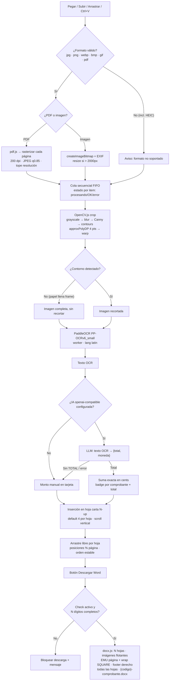

# Especificación — Cortar y Ordenar Facturas

App frontend-only, Chrome-only. TypeScript + Vite (dev server con `--open` y build de producción). Sin backend.

## Resumen

Pegar/subir/arrastrar imágenes y PDFs → recorte con OpenCV.js → OCR con PaddleOCR (PP-OCRv6_small) → extracción de TOTAL con LLM openai-compatible (o monto manual) → grilla carta N-up (default 4, arrastre libre tipo Word) → exportar .docx con footer derecho (código de pedido).

## Estructura / esqueleto

```
facturas/
├─ index.html
├─ package.json
├─ tsconfig.json
├─ vite.config.ts          # COOP/COEP, server.open, build → dist/
├─ .gitignore
├─ spec.md
└─ src/
   ├─ main.ts              # bootstrap app
   ├─ types.ts             # Comprobante, Estado, Config, OcrResult...
   ├─ state.ts             # estado global + persistencia (check, N, moneda, IA)
   ├─ ui/
   │  ├─ layout.ts         # esqueleto pantalla (header, monto, main, sidebar)
   │  ├─ sidebar.ts        # dropzone (arrastrar/clic/pegar), ordenar N, +OCR, limpiar, descargar
   │  ├─ sheets.ts         # render hojas carta, grilla N-up, drag & drop libre, scroll
   │  ├─ monto.ts          # badge por comprobante + suma total (cents exactos)
   │  ├─ ocrModal.ts       # ventana flotante texto OCR (solo lectura + copiar)
   │  └─ settingsModal.ts  # endpoint, model, apiKey, moneda
   ├─ pipeline/
   │  ├─ crop.ts           # OpenCV.js: grayscale→blur→Canny→contours→warp, fallback full
   │  ├─ ocr.ts            # PaddleOCR.create({ocrVersion:'PP-OCRv6', lang:'latin', worker:true})
   │  ├─ pdf.ts            # pdf.js → cada página a ImageBitmap (200dpi, JPEG .85, tope res)
   │  ├─ extract.ts        # LLM openai-compatible: texto OCR → {total, currency}
   │  └─ queue.ts          # cola secuencial FIFO, estado por item (procesando/OK/error)
   └─ export/
      ├─ docx.ts           # docx.js: N hojas, imágenes flotantes (EMU página, wrap SQUARE), footer
      └─ filename.ts       # {codigo}-comprobante.docx
```

## Decisiones (AC)

- **Código pedido:** check on/off + input N (solo dígitos), ambos persisten en localStorage; footer derecho en todas las hojas del .docx; check activo con < N dígitos → bloquear descarga con mensaje.
- **Monto:** 1 TOTAL por comprobante; suma exacta en cents (sin float); badge por comprobante + total; moneda configurable (default USD, formato US `1,234.56`); LLM sin TOTAL → campo manual en tarjeta (sí suma).
- **Limpiar:** borra comprobantes, montos y textos OCR; conserva check, N, y configuración IA/moneda.
- **Errores:** continuar + estado por item; el monto suma solo los OK; el resto se procesa.
- **Formato de entrada:** imágenes + PDF multipágina (cada página = comprobante, raster todas, sin omitir blancas); HEIC → aviso "formato no soportado", no falla la cola.
- **EXIF:** createImageBitmap con orientación respetada; redimensionar automática si > 2000px lado mayor.
- **Grilla:** N por hoja default 4; arrastre libre dentro de la hoja (posiciones % página, z-order), NO cambia el orden de inserción; X elimina comprobante completo; scroll vertical, hojas ajustadas al ancho.
- **OCR modal:** solo lectura, select por comprobante, botón copiar; texto usado solo por el LLM.
- **IA:** modal ajustes (baseURL, apiKey en localStorage, model por defecto gpt-4o-mini); sin config → monto manual; nunca expone la key en el repo.
- **Word:** docx.js estándar OOXML; imágenes flotantes con posición absoluta en EMU relativa a página + wrap SQUARE; footer derecho en todas las hojas; un solo archivo `{codigo}-comprobante.docx`; validar en Word y LibreOffice.
- **Dev/Prod:** `npm run dev --open` (Vite dev server, COOP/COEP en vite.config para WASM threads); `npm run build` → `dist/` para producción.

## Diagrama de flujo (mermaid)


